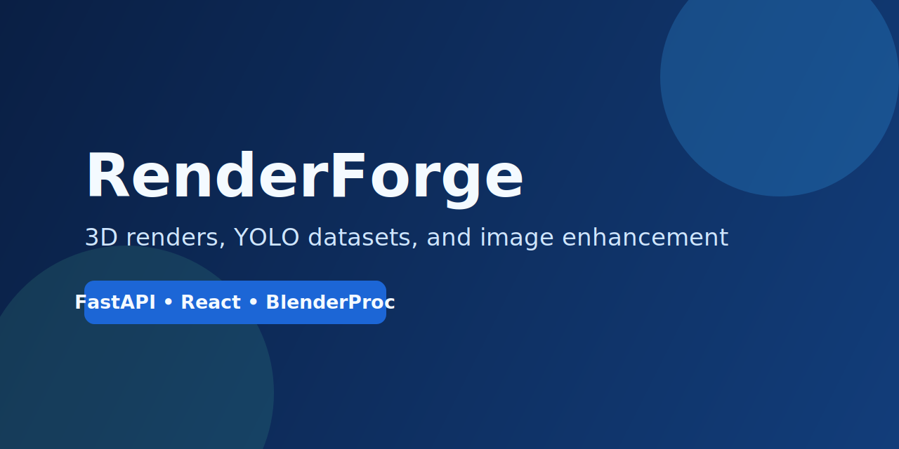
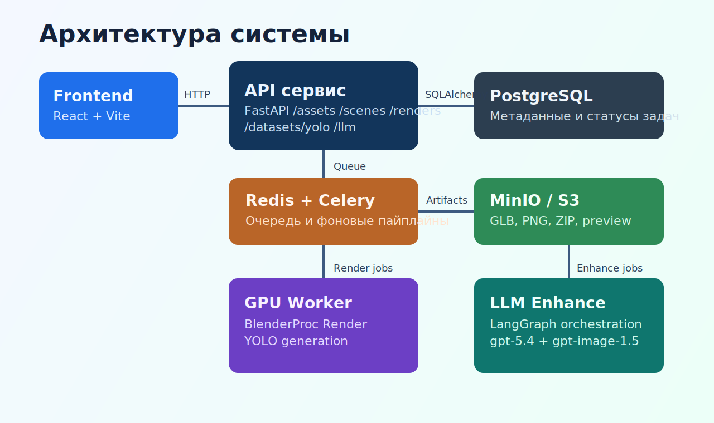
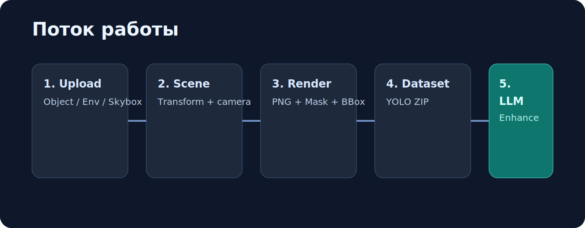

<div align="center">
  

  <h1>RenderForge</h1>
  <p><strong>Платформа для генерации 3D-рендеров, YOLO-датасетов и LLM-улучшения изображений</strong></p>

  <p>
    
    
    
    
    
    
  </p>
</div>

## Что это
`RenderForge` — full-stack сервис для пайплайна synthetic data:
- загрузка 3D-ассетов (object/environment/skybox);
- настройка сцены и одиночный рендер;
- генерация YOLO-датасета (image + bbox + mask + zip);
- LLM-enhance для повышения визуального реализма превью-кадров.

## Визуально


## Архитектура


## Основные возможности
- Upload ассетов через UI и API (`/assets/upload`).
- Создание сцен и правка конфигурации камеры/трансформаций (`/scenes`, `/scenes/{id}/config`).
- Асинхронный рендер через Celery + worker с GPU (`/renders`).
- Генерация YOLO датасета пакетами (`/datasets/yolo`).
- LLM-улучшение датасета через LangGraph + OpenAI (`/llm/enhance-dataset`).
- Хранение артефактов в MinIO (S3-compatible), выдача presigned URL.

## Поток работы


## Быстрый старт
### 1) Подготовка окружения
```bash
# убедитесь, что в .env заданы все обязательные переменные
# (OPENAI_API_KEY, DATABASE_URL, REDIS_URL, S3_* и др.)
```

### 2) Запуск через Docker Compose
```bash
docker compose up --build
```

### 3) Проверка сервисов
- Frontend: `http://localhost:5173`
- API: `http://localhost:8000`
- Healthcheck: `http://localhost:8000/health`
- MinIO API: `http://localhost:9000`
- MinIO Console: `http://localhost:9001`

## API (кратко)
Базовый префикс берется из переменной `API_PREFIX`.

| Метод | Endpoint | Назначение |
|---|---|---|
| `POST` | `/assets/upload?kind=object|environment|skybox` | Загрузка ассета |
| `GET` | `/assets` | Список ассетов |
| `POST` | `/scenes` | Создать сцену |
| `PATCH` | `/scenes/{scene_id}/config` | Обновить scene config |
| `POST` | `/renders` | Создать render job |
| `GET` | `/renders/{render_job_id}` | Статус рендера |
| `GET` | `/renders/{render_job_id}/result` | Результаты рендера |
| `POST` | `/datasets/yolo` | Создать dataset job |
| `GET` | `/datasets/yolo` | Список датасетов |
| `GET` | `/datasets/yolo/{dataset_job_id}` | Статус датасета |
| `GET` | `/datasets/yolo/{dataset_job_id}/result` | ZIP + summary |
| `POST` | `/llm/enhance-preview` | Быстрый preview улучшения |
| `POST` | `/llm/enhance-dataset` | Создать LLM enhance job |
| `GET` | `/llm/enhance-dataset/{enhance_job_id}` | Статус enhance |
| `GET` | `/llm/enhance-dataset/{enhance_job_id}/result` | Улучшенные примеры |

## Локальная разработка
### Backend
```bash
cd backend
python -m venv .venv
source .venv/bin/activate
pip install -r requirements.txt
uvicorn app.main:app --reload --host 0.0.0.0 --port 8000
```

### Frontend
```bash
cd frontend
npm install
npm run dev
```

## Тесты
### Backend
```bash
cd backend
pytest
```

### Frontend
```bash
cd frontend
npm test
```

## Структура проекта
```text
backend/
  app/
    api/routes/        # REST endpoints
    services/          # бизнес-логика рендера/датасетов/LLM
    scripts/           # BlenderProc и конвертация ассетов
frontend/
  src/
    components/        # React UI
    api/               # клиент API
    hooks/             # polling фоновых задач
docker-compose.yml     # оркестрация сервисов
docs/readme/           # изображения для README
```

## Технологический стек
- Backend: FastAPI, SQLAlchemy, Celery, Redis, PostgreSQL.
- 3D/Render: BlenderProc, Pillow.
- Storage: MinIO (S3 API), presigned URLs.
- Frontend: React, Vite, Three.js (`@react-three/fiber`, `@react-three/drei`).
- LLM: LangChain, LangGraph, OpenAI (`gpt-5.4`, `gpt-image-1.5`).

## Примечания по GPU
- Worker-контейнеры запускаются с `gpus: all`.
- Для корректного рендера нужен установленный NVIDIA runtime в Docker.
- Если GPU недоступен, рендер может завершаться ошибкой `GPU_UNAVAILABLE`.
